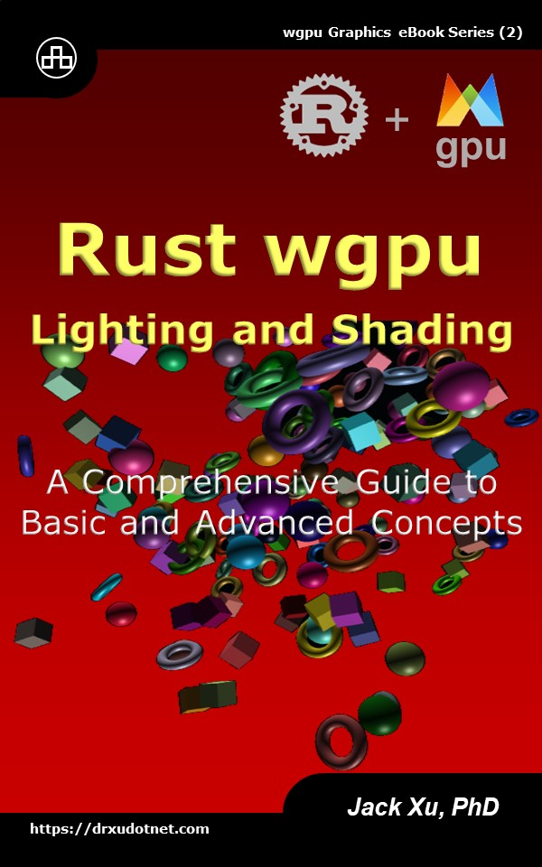

# Rust wgpu Lighting and Shading 
## A Comprehensive Guide to Basic and Advanced Concepts

This is a source code of example projects contained in the eBook ["Rust wgpu Lighting and Shading"](https://www.amazon.com/exec/obidos/ASIN/B0CLL5CT94/unicadinccom-20). 

